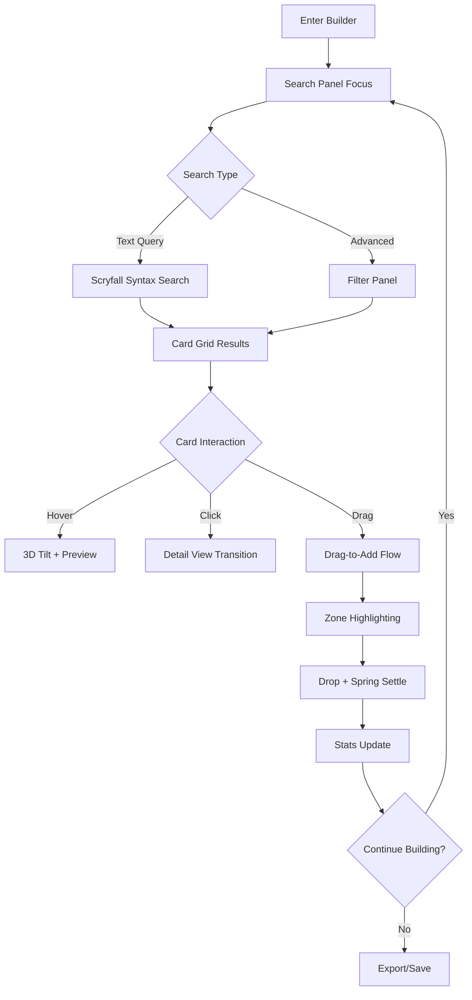

# MTG Deck Builder Prototype — UX Specification

**Version:** 1.0  
**Date:** 2026-04-19  
**Author:** Product Discovery Agent  
**Target:** Storybook Prototype Implementation  

## Executive Summary

This specification defines the UX for the MTG Deck Builder prototype — the primary user surface of the MTG App ecosystem. The prototype demonstrates video-game-quality motion design, Scryfall-powered search, and intuitive drag-and-drop deck construction.

**Key Requirements:**
- Storybook location: `Prototypes/` sidebar (NOT `Views/`)
- Mock data: ~50 Scryfall-formatted cards
- Animation stack: Motion + dnd-kit + Aceternity 3D + View Transitions API
- Performance: S-tier (transform + opacity) animations only
- Accessibility: Full `prefers-reduced-motion` support

---

## 1. User Personas & Use Cases

### Primary Personas

**Commander Enthusiast (40% of users)**
- Builds 3-5 decks simultaneously, thematic/synergistic focus
- Values exploration, card discovery, creative expression
- Needs visual organization, custom categories, card discovery tools

**Competitive Player (25% of users)** 
- Standard/Modern/Legacy focus, optimization-driven
- Values efficiency, meta awareness, quick iteration
- Needs fast search, sideboard planning, format compliance

**Casual Builder (20% of users)**
- Kitchen table Magic, budget-conscious
- Wants fun, playable decks without complexity
- Values simplicity, clear guidance, budget alternatives

**Collection Manager (15% of users)**
- "Build with what I own" mindset
- Heavy collection integration focus
- Needs efficient card reuse across multiple decks

### Core Use Cases
1. **Discovery & Exploration** — "Show me cards that work with my strategy"
2. **Focused Building** — "Build a specific archetype efficiently"  
3. **Iterative Refinement** — "Tune based on playtesting feedback"
4. **Budget Optimization** — "Make this work within my price range"
5. **Collection Integration** — "Use cards I actually own"

---

## 2. User Flows

### Primary Flow: Search → Select → Drag → Organize → Refine



### Secondary Flows

**Card Detail Exploration**
- Click card → View Transition morph → Detail panel → Related cards → Back to grid
- Supports keyboard navigation (Tab, Enter, Escape)

**Zone Management** 
- Mainboard: Primary canvas with custom categories
- Sideboard: Collapsible panel, 15-card format limit
- Maybeboard: Overlay panel, unlimited "considering" cards

**Settings & Preferences**
- Dark/light mode toggle with system preference sync
- Animation preferences (respects prefers-reduced-motion)
- Price vendor selection (TCGplayer, Card Kingdom, Cardmarket)

---

## 3. Component Architecture

### Layout Structure
```
DeckBuilder
├── SearchPanel (top bar)
├── MainContent (flex row)
│   ├── CardGrid (left, 60%)
│   │   └── Card3D components
│   └── DeckZones (right, 40%)
│       ├── MainboardZone
│       ├── SideboardZone (collapsible)
│       └── MaybeboardZone (overlay)
└── StatsPanel (bottom drawer)
```

### Key Components

**SearchPanel**
- Scryfall syntax input with highlighting
- Advanced filters dropdown
- Real-time search with 300ms debounce
- Auto-complete suggestions (max 5 items)

**CardGrid** 
- Virtualized grid (TanStack Virtual for 100+ items)
- Responsive columns (1-6 based on viewport)
- Infinite scroll with skeleton loading states
- Keyboard navigation support

**Card3D**
- Aceternity UI 3D card with hover tilt
- Specular highlight overlay on hover
- Drag handle indicator on drag-capable cards
- Loading states with shimmer animation

**DropZones**
- Visual zone highlighting during drag operations
- Spring physics card settling on drop
- Category management within zones
- Card count indicators and format limits

**StatsPanel**
- Real-time mana curve visualization
- Total price with vendor comparison
- Format legality status
- Type/color distribution charts

---

## 4. Interaction Design

### Card Hover Behavior
```typescript
// 3D tilt calculation from cursor position
const tiltX = (mouseY - centerY) * -0.1; // Max ±10 degrees
const tiltY = (mouseX - centerX) * 0.1;  // Max ±10 degrees

// Combined transform
transform: `
  perspective(1000px) 
  rotateX(${tiltX}deg) 
  rotateY(${tiltY}deg) 
  translateY(-8px)
`;
```

**Visual Effects**
- Hover lift: 8px translateY with growing shadow
- Specular highlight: Animated gradient overlay following cursor
- Transition: 200ms ease-out enter, 150ms ease-in exit

### Drag & Drop Flow

**Drag Start (80ms delay prevents accidental drags)**
1. Card scales to 1.05x with 3-degree rotation
2. Elevated shadow (0 20px 40px rgba(0,0,0,0.3))
3. Semi-transparent drag overlay follows cursor
4. Source card remains visible with reduced opacity

**Drag Over Zones**
1. Valid zones highlight with soft glow border
2. Zone scales up slightly (1.02x) on hover
3. Invalid zones show disabled state
4. Drop preview shows where card will land

**Drop Animation**
1. Card snaps to drop position
2. Spring physics settle (400ms duration)
3. Success feedback pulse on zone
4. Stats panel updates with count animation

### Keyboard Navigation
- Tab: Navigate between interactive elements
- Arrow keys: Navigate card grid (Roving tabindex)
- Enter: Select focused card or open detail view
- Space: Toggle card selection
- Escape: Clear focus or close modals
- Cmd/Ctrl + A: Select all visible cards

---

## 5. Animation System

### Performance Classification

**S-Tier (GPU, 60-120fps) — Use These**
- `transform: translateY()` for hover lift
- `transform: rotateX() rotateY()` for 3D tilt  
- `transform: scale() rotate()` for drag state
- `opacity` for fade transitions
- `box-shadow` changes for depth effects

**A-Tier (Paint only, 60fps) — Acceptable**
- `border-color` transitions
- `background-color` changes
- `color` text transitions

**Forbidden (Layout thrashing)**
- ❌ `width`, `height` animations
- ❌ `top`, `left` positioning
- ❌ `margin`, `padding` changes

### Library Integration

**Motion (Primary UI animations)**
```typescript
<motion.div
  whileHover={{ 
    rotateX: tiltX, 
    rotateY: tiltY, 
    translateY: -8 
  }}
  transition={{ duration: 0.2, ease: "easeOut" }}
>
```

**dnd-kit (Drag & drop)**
```typescript
const dragOverlay = useDragOverlay({
  transform: {
    x: offset?.x ?? 0,
    y: offset?.y ?? 0,
    scaleX: 1.05,
    scaleY: 1.05,
    rotation: 3
  }
});
```

**View Transitions API (Navigation)**
```typescript
// Card grid → detail panel morphing
if (document.startViewTransition) {
  document.startViewTransition(() => {
    showCardDetail(cardId); // Card has view-transition-name: card-{id}
  });
}
```

### Accessibility Implementation

**Reduced Motion Support**
```css
@media (prefers-reduced-motion: reduce) {
  .deck-builder * {
    animation-duration: 0.01ms !important;
    transition-duration: 0.01ms !important;
  }
  
  /* Maintain essential feedback with minimal motion */
  .card-hover {
    transform: translateY(-2px);
    transition: transform 150ms ease-out;
  }
}
```

**Focus Management**
- Visible focus states during all animations
- Focus trapping in modal states (card detail view)
- Skip links for keyboard navigation efficiency
- Screen reader announcements for state changes

---

## 6. Technical Implementation

### Mock Data Structure (Scryfall JSON)
```typescript
interface MockCard {
  id: string;
  name: string;
  mana_cost: string;
  cmc: number;
  type_line: string;
  oracle_text: string;
  colors: string[];
  color_identity: string[];
  rarity: 'common' | 'uncommon' | 'rare' | 'mythic';
  set_name: string;
  image_uris: {
    small: string;
    normal: string;  
    large: string;
  };
  prices: {
    usd: string | null;
    usd_foil: string | null;
  };
  legalities: Record<string, 'legal' | 'not_legal' | 'restricted' | 'banned'>;
}
```

### State Management
```typescript
interface DeckBuilderState {
  zones: DeckZone[];           // mainboard, sideboard, maybeboard
  searchQuery: string;         // Current search text
  searchResults: MockCard[];   // Filtered results
  selectedCards: Set<string>;  // Multi-selection state
  viewMode: 'visual' | 'text'; // Display preference
  darkMode: boolean;           // Theme preference
  isLoading: boolean;          // Loading states
}
```

### File Structure
```
src/components/prototypes/deck-builder/
├── DeckBuilder.stories.tsx       # Storybook entry point
├── DeckBuilder.tsx              # Main container
├── components/
│   ├── SearchPanel.tsx          # Search + filters
│   ├── CardGrid.tsx            # Virtualized results
│   ├── Card3D.tsx              # Individual card with 3D effects
│   ├── DropZones.tsx           # Deck zones container
│   └── StatsPanel.tsx          # Mana curve + stats
├── hooks/
│   ├── useDeckBuilder.ts       # Main state management
│   ├── useCardSearch.ts        # Search logic + debouncing
│   ├── useDragAndDrop.ts       # dnd-kit integration
│   └── useMotionPreference.ts  # Accessibility preferences
└── mock-data/
    └── cards.ts               # ~50 representative cards
```

### Performance Requirements
- **Mobile:** 60fps on iPhone 12 / Samsung Galaxy S21
- **Desktop:** 120fps on modern browsers
- **Memory:** < 100MB heap usage with 1000+ cards
- **Network:** Lazy load images, optimize for 3G networks
- **Bundle:** < 500KB gzipped for prototype code

---

## 7. Testing & Validation

### Acceptance Criteria

**Functional Requirements**
- [ ] Search supports Scryfall syntax (`c:red cmc<=3`)
- [ ] Drag-and-drop works across all zones  
- [ ] View Transitions morph cards between grid/detail
- [ ] Dark/light mode toggles smoothly
- [ ] Format legality enforced (15-card sideboard limit)
- [ ] Stats update in real-time as deck changes

**Performance Requirements**
- [ ] All animations maintain 60fps on target devices
- [ ] Virtual scrolling activates with 100+ search results
- [ ] prefers-reduced-motion disables non-essential animation
- [ ] Touch targets meet 44px minimum (mobile)

**Accessibility Requirements**  
- [ ] Keyboard navigation reaches all interactive elements
- [ ] Screen readers announce state changes
- [ ] Focus visible during all animations
- [ ] Color contrast meets WCAG AA standards in both themes

### Browser Support
- **Desktop:** Chrome 120+, Firefox 120+, Safari 17+, Edge 120+
- **Mobile:** iOS Safari 17+, Chrome Mobile 120+, Samsung Internet 23+
- **Features:** View Transitions API with graceful fallback

---

## 8. Future Integration Notes

### API Integration Points
- Replace mock search with Scryfall API (`/cards/search`)
- Integrate real pricing from TCGplayer/Card Kingdom APIs
- Connect to user collection for "cards I own" filtering
- Add deck save/load functionality

### Data Persistence
- Deck state stored in localStorage for prototype
- Future: User accounts with cloud deck storage
- Export formats: Arena, MTGO, plain text, CSV

### Advanced Features (Post-Prototype)
- AI deck critique and suggestions
- Combo detection via Commander Spellbook API
- Meta analysis integration (EDHREC, MTGGoldfish)
- Collaborative deck editing
- Version history and diff visualization

---

## 9. Development Handoff

### Getting Started
1. Install dependencies: `pnpm add motion @dnd-kit/core @aceternity/ui`
2. Create component structure under `src/components/prototypes/`
3. Set up Storybook story with controls for dark mode, card count
4. Implement search panel first (simplest component)
5. Add card grid with mock data
6. Integrate 3D hover effects using Aceternity UI
7. Implement drag-and-drop with dnd-kit
8. Add View Transitions for card detail morphing
9. Polish animations and performance test

### Key Implementation Notes
- Use TypeScript strict mode for type safety
- Follow existing shadcn/ui patterns for consistency  
- Test on mobile devices early and often
- Implement reduced motion support from day one
- Use React.memo() for performance-critical card components
- Measure bundle size impact of each animation library

### Questions for Implementation Team
1. **Image Assets:** Do we have access to Scryfall's image proxy for mock cards?
2. **Performance Budget:** What's the acceptable JS bundle size for the prototype?
3. **Testing:** Should we include Playwright tests for drag-and-drop interactions?
4. **Deployment:** How will stakeholders access the Storybook for review?

---

**Implementation Priority:** High  
**Estimated Effort:** 2-3 sprint cycles  
**Dependencies:** Aceternity UI setup, mock card image assets  
**Success Metric:** Video-game-quality motion that delights users and validates the animation stack for the broader MTG App ecosystem.